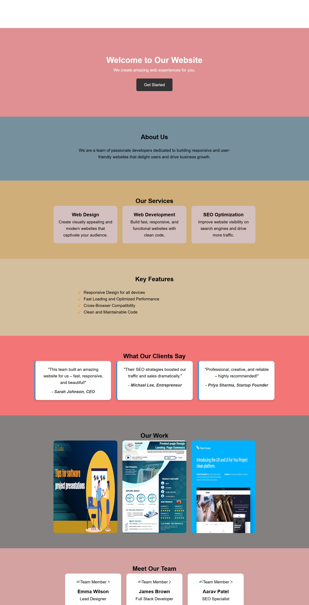

# Landing Page Internship Task

A **responsive landing page** built using **HTML5** and **CSS3** as part of my **Web Development Internship Task 1**.

---

## 📋 Table of Contents

- [🎨 Screenshots](#-screenshots)  
- [🛠️ Tools Used](#️-tools-used)  
- [📂 Project Structure](#-project-structure)  
- [📖 How to Run](#-how-to-run)  
- [✅ Outcome](#-outcome)  

---

## 🎨 Screenshots

**Hero Section Preview:**  


**Full Landing Page Preview:**  


*(Add more screenshots if needed for About, Services, Portfolio, etc.)*

---

## 🛠️ Tools Used

- **VS Code** – code editor  
- **Chrome Browser** – testing and preview  
- **Live Server Extension** – live preview of changes  

---

## 📂 Project Structure

```
landing-page-internship-task/
├── index.html # Main HTML file
├── style.css # CSS styling
├── assets/ # Images and icons
│ ├── hero1.jpg
│ ├── homepage-screenshot.png
│ └── other images...
├── README.md # Project description
└── .gitignore # Git ignore file
```

---

## 📖 How to Run

1. Clone the repository:  
```bash
git clone https://github.com/vidya200000/landing-page-internship-task.git
```

